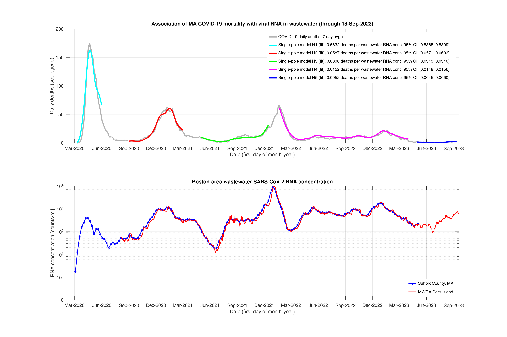

# covid_calc

This calculation reproduces Massachusetts COVID-19 mortality data from wastewater RNA measurements. Four distinct periods are apparent, with ever-decreasing viral lethality (first graph below).  Each model H1 to H4 corresponds to one such period and is drawn in a different color.  There are two fit parameters per model: (1) deaths per wastewater RNA concentration and (2) time delay.  From these two parameters and the wastewater measurements (second graph), mortality data are reproduced.  For the most recent model H4, the post-hoc prediction matches the observed mortality.



Each model is a single-pole [linear time-invariant system](https://en.wikipedia.org/wiki/Linear_time-invariant_system), equivalent to an RC circuit and suitable for time-decay processes.  Parameters are below, including 95% confidence intervals in square brackets.

| Model|       From|         To|      Deaths per RNA/ml|     Delay (days)|
|------|-----------|-----------|-----------------------|-----------------|
|    H1|10-Mar-2020|01-Jun-2020| 0.559 [0.5337, 0.5840]|14.8 [13.0, 16.7]|
|    H2|01-Sep-2020|01-Mar-2021| 0.058 [0.0569, 0.0601]|10.4 [ 8.9, 11.9]|
|    H3|01-May-2021|15-Dec-2021| 0.033 [0.0315, 0.0348]|32.6 [28.6, 36.5]|
|    H4|21-Jan-2022|01-Apr-2022| 0.017 [0.0160, 0.0176]|19.6 [17.7, 21.4]|

### Running the calculation
Requires [GNU Octave](https://octave.org/) and the packages *io*, *optim*, and *signal*.

On Linux:
```
git clone https://github.com/s1rh3nry/covid_calc.git
cd covid_calc/MA_water
octave --no-gui
```
From the *octave* (version 4.2.2) prompt run:
```
plotMWRA
```
### Data sources
[Wastewater from Biobot Analytics](https://github.com/biobotanalytics/covid19-wastewater-data) - see also [here](https://www.mwra.com/biobot/biobotdata.htm).

[Mortality from the State of Massachusetts](https://www.mass.gov/info-details/covid-19-response-reporting) - download *COVID-19 Raw Data*, updated weekly.

### References
1. Claire Duvallet, Fuqing Wu, Kyle A. McElroy, Maxim Imakaev, et al. *Nationwide Trends in COVID-19 Cases and SARS-CoV‐2 RNA Wastewater Concentrations in the United States*, [ACS EST Water 2022, 2, 1899−1909](https://pubs.acs.org/action/showCitFormats?doi=10.1021/acsestwater.1c00434)

### Licenses
- The calculation code is free to use and distribute without restrictions under [MIT-0](LICENSE) license.
- Wastewater data is produced by Biobot Analytics and licensed under [CC BY-NC 4.0](https://creativecommons.org/licenses/by-nc/4.0/).
