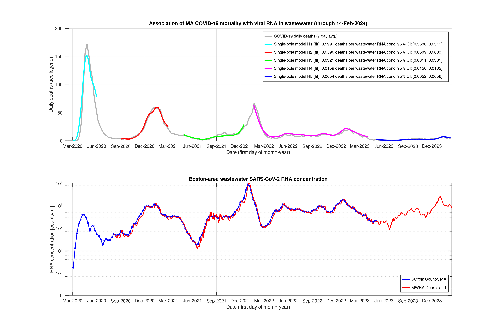

# covid_calc

This calculation reproduces Massachusetts COVID-19 mortality data from wastewater RNA measurements. Five distinct periods are apparent, with ever-decreasing viral lethality (first graph below).  Each model H1 to H5 corresponds to one such period and is drawn in a different color.  There are two fit parameters per model: (1) deaths per wastewater RNA concentration and (2) time delay.  From these two parameters and the wastewater measurements (second graph), mortality data are reproduced.



Each model is a single-pole [linear time-invariant system](https://en.wikipedia.org/wiki/Linear_time-invariant_system), equivalent to an RC circuit and suitable for time-decay processes.  Parameters are below, including 95% confidence intervals in square brackets.

| Model|       From|         To|      Deaths per RNA/ml|     Delay (days)|
|------|-----------|-----------|-----------------------|-----------------|
|    H1|04-Mar-2020|01-Jun-2020| 0.600 [0.5688, 0.6311]|21.5 [18.8, 24.2]|
|    H2|01-Sep-2020|01-Mar-2021| 0.060 [0.0589, 0.0603]|14.6 [13.8, 15.4]|
|    H3|01-May-2021|15-Dec-2021| 0.032 [0.0311, 0.0331]|38.8 [36.0, 41.5]|
|    H4|21-Jan-2022|01-Apr-2023| 0.016 [0.0156, 0.0162]|23.8 [22.7, 25.0]|
|    H5|01-May-2023|10-Feb-2024| 0.005 [0.0052, 0.0056]|34.2 [29.7, 38.7]|

Reference 2 discusses the changing transfer function from wastewater concentration to clinical cases and mortality (H1 to H2) and speculates about possible causes.  Changing clinical practice and evolving disease demographics are mentioned.

### Running the calculation
Requires [GNU Octave](https://octave.org/) and the packages *io*, *optim*, and *signal*.

On Linux:
```
git clone https://github.com/s1rh3nry/covid_calc.git
cd covid_calc/MA_water
octave --no-gui
```
From the *octave* prompt run:
```
plotMWRA
```
(Tested on versions 4.2.2, 5.2.0 and 6.4.0)
### Data sources
Wastewater (Suffolk County, MA) from Biobot Analytics (this github repository is no longer available).  

[Current wastewater data](https://www.mwra.com/biobot/biobotdata.htm) (MWRA Deer Island).

[Mortality from the State of Massachusetts](https://www.mass.gov/info-details/covid-19-response-reporting) - download *COVID-19 Raw Data*, updated weekly.  Note that year 2020 data is being changed in 2023.

To update data on Linux, from *covid_calc* run:
```
./getData.sh
```
### References
1. Claire Duvallet, Fuqing Wu, Kyle A. McElroy, Maxim Imakaev, et al. *Nationwide Trends in COVID-19 Cases and SARS-CoV‐2 RNA Wastewater Concentrations in the United States*, [ACS EST Water 2022, 2, 1899−1909](https://pubs.acs.org/action/showCitFormats?doi=10.1021/acsestwater.1c00434)
2. Amy Xiao, Fuqing Wu, Mary Bushman, et al. *Metrics to relate COVID-19 wastewater data to clinical testing dynamics*, [Water Research 212 (2022) 118070](https://doi.org/10.1016/j.watres.2022.118070)
### Licenses
- The calculation code is free to use and distribute without restrictions under [MIT-0](LICENSE) license.
- Wastewater data until May, 2023 was produced by Biobot Analytics and licensed under [CC BY-NC 4.0](https://creativecommons.org/licenses/by-nc/4.0/).
- Later wastewater data is published by the State of Massachusetts.
